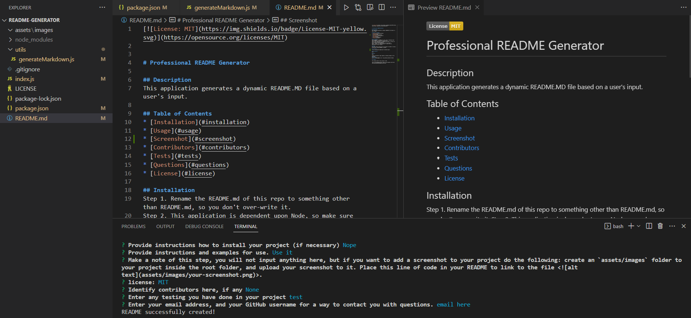

# Professional README Generator

## Description
This application generates a dynamic README.MD file based on a user's input.

## Table of Contents
* [Installation](#installation)
* [Usage](#usage)
* [Screenshot](#screenshot) 
* [Contributors](#contributors)
* [Tests](#tests)
* [Questions](#questions)
* [License](#license) 

## Installation
Step 1. Rename the README.md of this repo to something other than README.md, so you don't over-write it.
Step 2. This application is dependent upon Node, so make sure you already have Node installed.
Step 3. Install the dependencies with 'npm install'.
Step 4. Finally, run 'node index.js' to start the CLI application in your terminal.

## Usage
Use case scenario would be for any project on GitHub to create a professional looking README in seconds.

## Screenshot
<>

## Contributors
None

## Tests
None

Contact information (email address & GitHub username) of the developer
## Questions
kevin.o.foreman2@gmail.com // www.github.com/kevin-foreman

## License

The license used for this project is MIT.

Link to video demonstration: https://drive.google.com/file/d/16RsiCHavyyjKZF0O3JKCBwgSCcX0-tbO/view